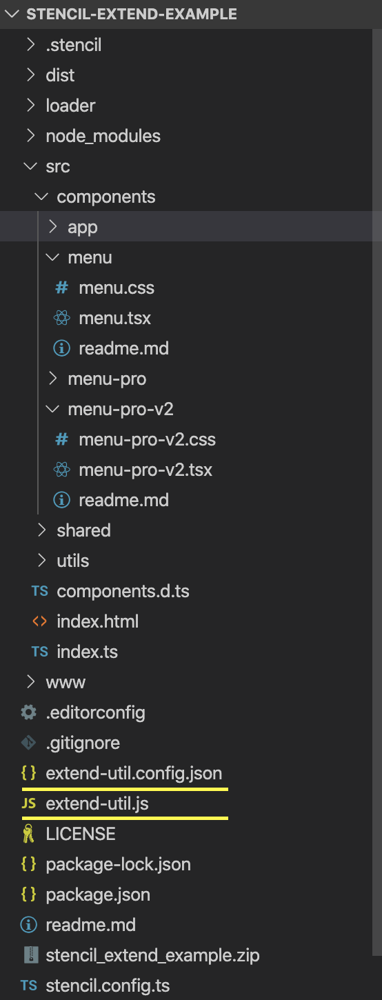

# Extending Stencil components example

This is a example project build to try inheriting components in StencilJS easily.

## Challanges

There are several challanges when you think of inheriting components in StencilJS. Here is the list -

* Extending a component class is blocked by StencilJS compiler.
* @Component decorator cannot be used with any other custom decorator.
* @Component does not allow to override its functionality.
* Ionic team is not sure when they will be supporing extending web components as W3C also in review for the same and facing some challanges to support the feature.

## Options We Have

There are many options we tried but most of them are a kind of hack and has some limitations.

### Trying to set prototype of the Component in constructor.

Although this option does some of the part but not completely inherit the features (as most of the features are injected in compiled code underlying by stencil compiler).
For this we would have to do most stuffs that does not work -
- Typescript types for base component would not be supported as we have not used extends keyword.
- Styles would not be inherited due to shadow DOM.
- Have to provide hooks or custom decorators for most of the funtionalities like events, DOM treeshaking, watchers does not work.
  - As a work around we have to put several setIntervals method calls to sync data between component and its prototype and have to forcefully call render whenever a change happens in binding properties.

This would be hapening all at *runtime* that would impact application performance.

### Changes at Compile Time (Implemented in this Repository)

So as a Solution I have created an extended utiity that would work at compile-time.
Its main responsibility would be to changed the prototype of the component at compile-time before any stencil logic hooks in.

1. In the Project solution I have added 2 files for achieving this at root level -
- extend-util.js
- extend-util.config.json



2. Modefied package.json to run my scripts (when running *npm start* or *npm run build*)
- under script section changed following -
  - "build": "node extend-util.js --docs"
  - "start": "node extend-util.js --watch --serve

```json

{
  "name": "stencil-extend-example",
  "version": "0.0.1",
  "description": "Stencil Component Starter",
  "main": "dist/index.js",
  "module": "dist/index.mjs",
  "es2015": "dist/esm/index.mjs",
  "es2017": "dist/esm/index.mjs",
  "types": "dist/types/index.d.ts",
  "collection": "dist/collection/collection-manifest.json",
  "collection:main": "dist/collection/index.js",
  "unpkg": "dist/stencil-extend-example/stencil-extend-example.js",
  "files": [
    "dist/",
    "loader/"
  ],
  "scripts": {
    "build": "node extend-util.js --docs",
    "start": "node extend-util.js --watch --serve",
    "start-dev": "stencil build --dev --watch --serve",
    "test": "stencil test --spec --e2e",
    "test.watch": "stencil test --spec --e2e --watchAll",
    "generate": "stencil generate"
  },
  "devDependencies": {
    "@stencil/core": "^1.8.4"
  },
  "license": "MIT"
}


```

3. In any component if we want to extend another component use like this -

```typescript

import { Component, Prop, h } from '@stencil/core';

import '../menu/menu';                  // Required: This will include the Extending component in same bundle.
import { Menu } from '../menu/menu';    // Requires only to refer types of base class

// This Component is inheriting features from 'my-menu' component.
// The mapping is defined in extend-util.config.json
@Component({
    tag: 'my-menu-pro-v2',
    styleUrl: 'menu-pro-v2.css',
    shadow: true
})
export class MenuProV2 {

    // Need to declare Required Properties of base component
    @Prop() declare items: Array<{ id?: string, value: string, selected?: boolean }>;
    @Prop() declare header: string;
    super: Menu;    // super will be refering to the base class instance

    // This function is overriden, so we can use this.super to access the base method functionality.
    clickMe() {
        this.header = 'New Header';
        alert('Submit clicked from Menu Pro 2');
        this.super.clickMe();
    }

    // Overriding Menu render function with additional html
    render() {
        return <div>
            <h3>Menu Pro Header</h3>
            <div>{this.super.render()}</div>
            <div class="footer-v2">This is footer note</div>
        </div>
    }

}

```

## Steps to Get Started

Clone this repository and execute following commands at root folder into the terminal -

```bash
npm install
npm start
```

To build the component for production, run:

```bash
npm run build
```

## Work still in progress

Please note that this is not fully tested with all features/scenarios we can have in any stencil component.

There might be issues as its just a prototype, and not tested well, there are no unit test cases, also some code refactoring is required.
