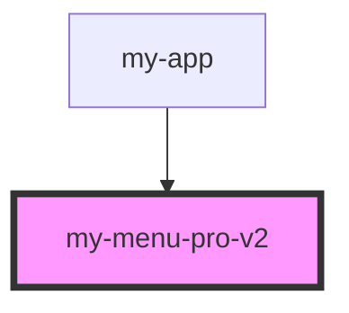

# my-menu-pro-v2

<!-- Auto Generated Below -->

## Properties

| Property | Attribute | Description | Type                                                    | Default     |
| -------- | --------- | ----------- | ------------------------------------------------------- | ----------- |
| `header` | `header`  |             | `string`                                                | `undefined` |
| `items`  | --        |             | `{ id?: string; value: string; selected?: boolean; }[]` | `undefined` |

## Dependencies

### Used by

 - [my-app](../app)

### Graph

----------------------------------------------

*Built with [StencilJS](https://stenciljs.com/)*
