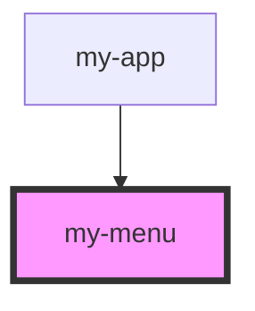

# my-menu

<!-- Auto Generated Below -->

## Properties

| Property | Attribute | Description | Type          | Default |
| -------- | --------- | ----------- | ------------- | ------- |
| `header` | `header`  |             | `string`      | `''`    |
| `items`  | --        |             | `IMenuItem[]` | `[]`    |

## Dependencies

### Used by

 - [my-app](../app)

### Graph

----------------------------------------------

*Built with [StencilJS](https://stenciljs.com/)*
